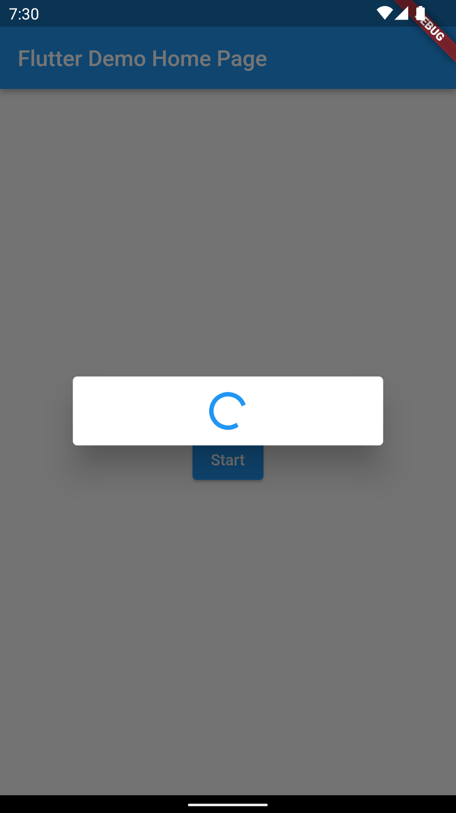
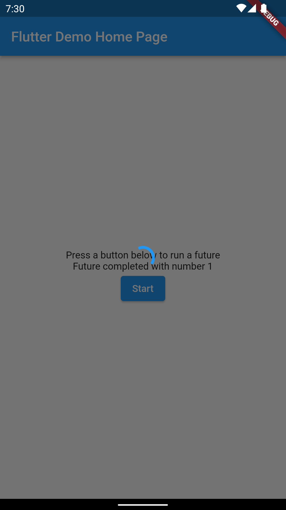

<!--
This README describes the package. If you publish this package to pub.dev,
this README's contents appear on the landing page for your package.

For information about how to write a good package README, see the guide for
[writing package pages](https://dart.dev/guides/libraries/writing-package-pages).

For general information about developing packages, see the Dart guide for
[creating packages](https://dart.dev/guides/libraries/create-library-packages)
and the Flutter guide for
[developing packages and plugins](https://flutter.dev/developing-packages).
-->

## About
A Loading overlay dialog for showing future loading UI.




## Features

- Show simple loading dialog
- Option to show expanded dialog (full screen) or simple loading dialog
- Hide when future is completed with result or exception

## Getting started

To use this package, add `future_loading_overlay` as a dependency in your pubspec.yaml file.

## Usage

Import the library.

```dart
import 'package:future_loading_overlay/future_loading_overlay.dart';
```

Then invoke the `showFutureLoadingOverlay` function anywhere in your Dart code.

```dart
showFutureLoadingOverlay(
    context: context,
    future: _yourFutureFunction(),
);
```

The `showFutureLoadingOverlay` function also takes an optional `expanded` that will be used to show full screen loading overlay.

```dart
showFutureLoadingOverlay(
    context: context,
    future: _yourFutureFunction(),
    expanded: true,
);
```

To get a result of future annotate a function with type `<T>` and create a variable that store a result of your future.

```dart
final result = await showFutureLoadingOverlay<int>(
    context: context,
    future: _yourFutureFunction(),
);
```